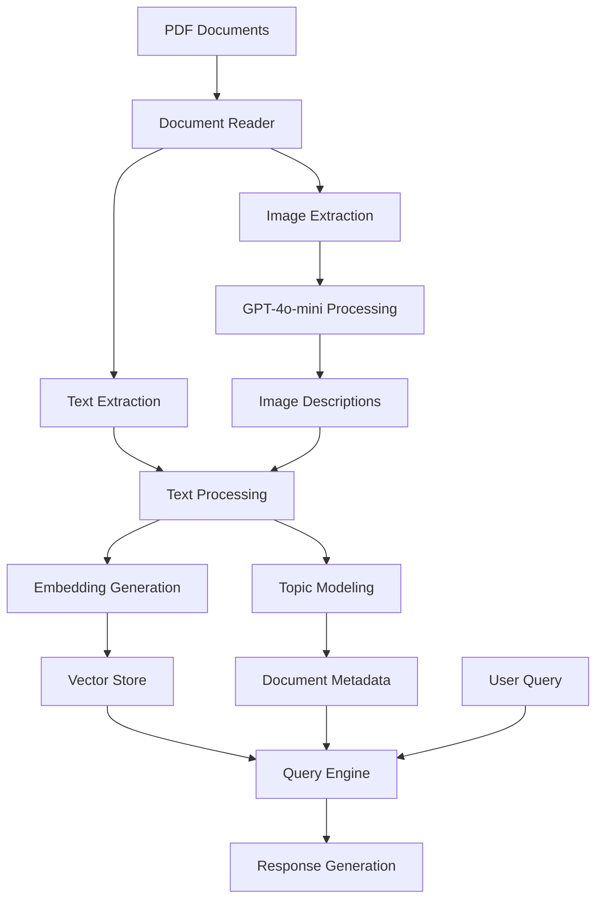

# Awesome Multimodal RAG Agent with Topic Modeling, Image Recognition and All Things Nice

A Retrieval-Augmented Generation (RAG) system that combines LlamaIndex, BERTopic, GPT-4o-mini, and Claude 3.5+ for intelligent document analysis and question answering, with support for both text and images.


Extra questions – "what a human would've asked about this page?" – are getting generated:


All vectorised and topics defined by BERTopic.


Let's ask some questions:


Let's get specific:


Note: All data presented is mock data, and any similarities to actual information or events are purely coincidental.

## Overview

This project implements an advanced RAG system that:
- **Processes PDF documents** including both text and images
- **Extracts and analyzes images** using GPT-4o-mini
- **Processes text** using OpenAI embeddings
- **Performs topic modeling** with BERTopic
- **Generates contextual questions** for each document
- **Provides intelligent question answering** using Claude 3.5
- **Maintains persistence** with vector store indexing

## Features

- **Multimodal Processing**: 
  - Extracts text and images from PDFs
  - Processes images with GPT-4o-mini for detailed descriptions
  - Handles various image formats (JPEG, PNG, RGBA)
- **Document Processing**: Automated processing of documents from an input directory
- **Embedding Generation**: Uses OpenAI's `text-embedding-ada-002` model
- **Topic Modeling**: Implements BERTopic for document clustering
- **Question Generation**: Automatically generates relevant questions
- **Persistent Storage**: Maintains vector store for quick access
- **Error Handling**: Robust error management with informative messages

## Installation

1. Install dependencies:
```bash
pip install -r requirements.txt
```

2. Set up environment variables in `.env`:
```env
OPENAI_API_KEY=your-openai-api-key
ANTHROPIC_API_KEY=your-anthropic-api-key
```

## Usage

1. Place your PDF documents in the `input` directory
2. Run the RAG agent:
```bash
python rag_agent.py
```

3. Start asking questions about your documents

## Technical Details

### How It Works

The system operates through several key components:

1. **PDF Processing**
   - Extracts text and images from PDF documents
   - Processes each page sequentially
   - Handles multiple image formats

2. **Image Processing**
   - Converts images to consistent format (JPEG)
   - Resizes to 150 DPI for optimal processing
   - Generates detailed descriptions using GPT-4o-mini

3. **Document Processing**
   - Combines text and image descriptions
   - Generates embeddings using OpenAI
   - Creates searchable vector store

4. **Topic Modeling**
   - Uses BERTopic to identify themes
   - Adapts to document set size
   - Enhances retrieval relevance

5. **Query Processing**
   - Analyzes queries for topic relevance
   - Retrieves relevant content
   - Generates responses using Claude 3.5

### Architecture



## Requirements

- Python 3.8+
- OpenAI API access
- Anthropic API access
- Required packages listed in `requirements.txt`

## Dependencies

```
llama-index
python-dotenv
anthropic
bertopic
umap-learn
scikit-learn
ell-ai
openai
numpy
```

## Error Handling

The system includes robust error handling for:
- Missing documents
- API failures
- Embedding dimension mismatches
- Topic modeling issues

## Performance Considerations

- Embedding generation costs are based on OpenAI's pricing
- Initial processing time depends on document volume
- Subsequent queries benefit from cached embeddings
- Topic modeling adds computational overhead but improves retrieval quality

## Future Improvements

- [ ] Add support for more document formats
- [ ] Implement caching for API calls
- [ ] Add evaluation metrics for retrieval quality
- [ ] Enhance topic modeling with custom parameters
- [ ] Add support for streaming responses

## Contributing

Contributions are welcome! Please feel free to submit a Pull Request.

## Acknowledgments

- LlamaIndex for the core RAG functionality
- BERTopic for topic modeling capabilities
- OpenAI for embeddings
- Anthropic for Claude 3.5 LLM

## How it works

# Building a Smart Document Helper: How RAG Works 🤖

Hey there! Let's explore how this awesome program works. It's like having a super-smart assistant that can read your documents AND look at pictures!

## 🎯 What Can It Do?

When you give it PDF documents, this program can:
1. Read all the text
2. Look at all the pictures
3. Understand what both text and pictures mean
4. Answer questions about everything it sees
5. Remember all this information for later

## 🧩 The Main Parts

### 1. The Document Reader 📚
```python
pdf_document = fitz.open(pdf_path)
```
This is like having a helper that:
- Opens each PDF file
- Goes through it page by page
- Finds both text and pictures

### 2. The Picture Helper 🖼️
```python
image = Image.open(BytesIO(image_bytes))
description = self._get_image_description(image_node)
```
When it finds a picture, it:
1. Takes the picture out of the PDF
2. Makes sure it's clear and the right size
3. Asks GPT-4o-mini (a smart AI) to describe what it sees
4. Saves both the picture and its description

### 3. The Smart Memory System 🧠
The program uses three cool tricks:

#### Text Understanding
```python
self.embed_model = OpenAIEmbedding(...)
```
Turns words into numbers so the computer can understand them better.

#### Picture Understanding
```python
self.openai_client = OpenAI(...)
```
Uses GPT-4o-mini to look at pictures and describe them in words.

#### Topic Finding
```python
self.topic_model = BERTopic(...)
```
Groups similar information together, like sorting books in a library.

### 4. The Question Answerer 💭
When you ask a question:
1. The program looks through all its stored information
2. Finds relevant text and picture descriptions
3. Creates a helpful answer using everything it knows

### 5. The Memory Keeper 💾
```python
self.index.storage_context.persist(...)
```
Saves everything it learns so it doesn't have to start over next time!

## 🎮 Using It

1. Put your PDF files in the `input` folder
2. Start the program
3. Ask questions about anything in the documents
4. The program will use both text and pictures to answer you!

## 🌟 What Makes It Special

1. **Sees Everything**: It can read text AND understand pictures
2. **Smart Memory**: Remembers both what it reads and what it sees
3. **Quick Learning**: Groups similar information together
4. **Helpful Answers**: Uses all available information to answer questions
5. **Gets Better**: Learns and improves as it processes more documents

Remember: You can ask about both text AND pictures in your documents! 🌈
